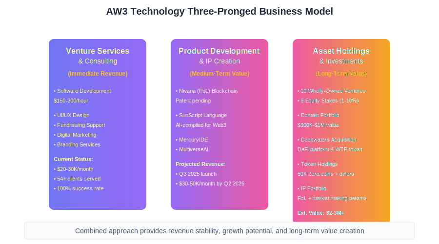
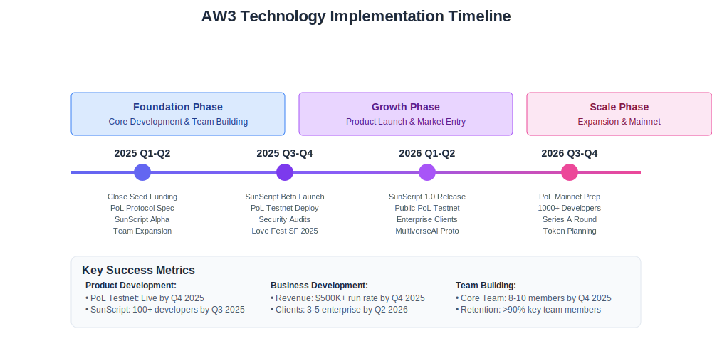

# AW3 TECHNOLOGY, INC.
## REVISED BUSINESS PLAN

---

## 1. EXECUTIVE SUMMARY

AW3 Technology is an award-winning San Francisco-based venture studio founded in 2022 that develops and invests in early-stage startups at the intersection of AI and Web3. Our vision is to become the decentralized cloud layer powering the next internet — **the AWS of Web3** — offering modular, scalable infrastructure, tools, and services for builders, organizations, and networks.

AW3 stands for Andromeda Web3 — named after the galaxy on a collision course with the Milky Way. This symbolizes the reimagining of how we innovate and manage our global economy, where collision becomes fusion. AI meets ethics. Crypto meets compassion. We build startups that don't just scale — they heal and empower.

With a portfolio of 10 wholly-owned startups and equity stakes in 7 others, AW3 generates $20K-$30K in monthly revenue through B2B software development, consulting, and equity-based partnerships. Our client portfolio includes funded companies like Bitwage (helped secure $4MM), Blocksee, Carnomaly, and Wryter.

**Our Core Innovation:** The Proof of Love (PoL) blockchain consensus mechanism, with a provisional patent filed, represents our flagship technology. PoL creates a more equitable, energy-efficient blockchain by balancing economic stake with community contribution through the Trinity Score (T = √(S × B)), where S represents staked assets and B represents contributions to the network.

**Our Focused Strategy:** While our long-term vision is comprehensive, we are initially focusing on developing two core products:
- **Nivana (PoL) Blockchain:** Our revolutionary consensus mechanism
- **SunScript:** An AI-compiled programming language optimized for Web3 development

AW3 operates under a three-pronged business model:
1. Venture Services & Consulting (immediate revenue)
2. Product Development & IP Creation (medium-term value)
3. Asset Holdings & Equity Investments (long-term value)

In 2025, AW3 completed a strategic acquisition of Deepwaters (through parent company VatnFörn Corp.), a decentralized finance platform that raised $6.78 million in its 2023 ICO. The acquisition for a nominal $1 purchase price includes all intellectual property including a market making software patent, the WTR token ecosystem, and smart contract infrastructure. AW3 is issuing $500,000 in SAFEs (capped at $5M valuation) to prior stakeholders, with 70% allocated to investors and 30% to founders/team members. This acquisition strengthens our DeFi capabilities and positions Deepwaters to become a tokenized equity exchange for acquiring distressed companies.

**Our Development Edge:** We've pioneered an AI-accelerated development methodology that delivers MVPs in 1-30 days instead of 3-6 months. This approach combines AI-powered tools (GitHub Copilot, Claude, GPT-4), no-code/low-code platforms, and traditional development where needed. We operate on a dual-track model: 50% building internal ventures, 50% serving clients - creating a virtuous cycle where client work funds innovation while internal projects enhance our capabilities.

**Community Leadership:** Beyond technology, AW3 demonstrates leadership through major community initiatives. We host LoveFestSF annually, a free block festival that drew 10,000+ attendees in 2024, showcasing our event production capabilities and community engagement. In May 2026, we'll co-host the inaugural Silicon Valley Economic Forum with portfolio company Baird Augustine, positioning AW3 as a thought leader in the innovation ecosystem.

**Funding Objective:** We are seeking $1.5-2M in seed funding to:
- Build and launch the PoL testnet with 50+ validators
- Develop SunScript to beta with 100+ developers
- Expand our team with critical hires (blockchain engineer, AI researcher, product manager)
- Execute our go-to-market strategy targeting 1,000+ developers by Q4 2025

Additionally, we're launching Olifant Capital, a $10M venture fund with AW3 as GP, to invest in the AI×Web3 ecosystem we're building.

---

## 2. MARKET OPPORTUNITY & PROBLEM STATEMENT

### Market Size & Growth
- The global blockchain market is projected to grow from $7.18 billion in 2022 to $163.83 billion by 2029, at a CAGR of 56.3%
- The AI software market is forecasted to reach $126 billion by 2025
- Web3 venture funding exceeded $7.1 billion in 2021 despite market volatility

### Key Problems We Address

**For Developers**
- Existing blockchain development is complex and resource-intensive
- Current consensus mechanisms favor capital concentration (PoS) or waste energy (PoW)
- Web3 lacks the integrated, developer-friendly infrastructure that AWS provides for Web2

**For Startups**
- 90% of startups fail, with 42% failing due to no market need
- Traditional venture funding is inaccessible for many founders (acceptance rates below 2%)
- Prohibitive costs for early-stage entrepreneurs without wealthy networks

**For the Ecosystem**
- Siloed development leads to redundant products and wasted resources
- Winner-takes-all mentality creates unsustainable competition
- Extractive economic models that concentrate wealth

### Our Solution
AW3 provides a more collaborative, efficient approach to building Web3 startups through:
- Shared infrastructure and resources across portfolio companies
- Novel consensus mechanism that rewards contribution alongside stake
- Developer-focused tools that reduce complexity and increase productivity

---

## 3. COMPANY OVERVIEW

### Mission Statement
To create technology that fuses AI and Web3 to foster cooperation, transparency, and equitable wealth distribution.

### Vision Statement
A world where technology serves as a force for economic fairness, creative freedom, and social resilience.

### Development Philosophy - "Building at the Speed of Thought"
At AW3 Technology, we've redefined what it means to build world-class software. We believe that the traditional approach to software development — months of planning, massive teams, and million-dollar budgets — is obsolete. Instead, we've pioneered a development methodology that combines AI-powered tools, no-code/low-code platforms, and rapid iteration to deliver institutional-grade solutions in days, not months.

**Our AI-Accelerated Development Stack:**
- **AI-Powered Development:** GitHub Copilot, Claude, GPT-4 for intelligent code generation and rapid prototyping
- **No-Code/Low-Code Platforms:** Bubble.io, Webflow, Zapier, Retool, Supabase for rapid development
- **Traditional Development:** React/Next.js, Node.js/Python, Rust for specialized requirements

This hybrid approach allows us to move at 10x the speed of traditional development shops while maintaining the flexibility to build custom solutions where they matter most.

### Company History
AW3 Technology was founded by William Schulz in 2022 in response to growing disillusionment with extractive business models and venture capital practices that prioritized speed over substance.

Since founding, AW3 has:
- Developed a portfolio of 10 wholly-owned startups
- Acquired equity stakes (1-10%) in 7 high-potential startups
- Filed a provisional patent for the Proof of Love consensus mechanism
- Generated consistent monthly revenue through software development and consulting
- Acquired strategic domain names across Web3, AI, and fintech sectors
- Completed the strategic acquisition of Deepwaters (VatnFörn Corp.) for $1 nominal price, including all IP, WTR token ecosystem, and smart contracts
- Structured $500,000 in SAFE grants to prior Deepwaters stakeholders (70% investors, 30% team) at $5M valuation cap
- Launched and hosts LoveFestSF annually (2024 & 2025), drawing 10,000+ attendees to this free San Francisco block festival
- Partnered to co-host the inaugural Silicon Valley Economic Forum (May 2026) through portfolio company Baird Augustine
- Received the 1000X award from the Treasurer of California for contributions to innovation

### Leadership & Team

**William Schulz - Founder & CEO**
- Education: University of California, Santa Barbara (2009-2013)
  - Double major in Computer Science and Economics
  - Relevant coursework: Machine Learning, Data Structures & Algorithms, Human Computer Interaction
- Technical Expertise: C++, Java, Python, React, Node.js, Web3; Machine learning, data mining, Android development
- Previous Experience:
  - Silicon Valley BI Consultant and Data Analyst (2013-2016)
  - Founder of We Stand Up 501(c)(4) Non-Profit (2017-2020)
  - Founder of Learna C-Corp B2B E-Learning Software
  - VC Lab Executive Consultant for Pre-Seed and Seed stage Startups (2020-Present)
- Recognition: Received 1000X award from California Treasurer Fiona Ma for contributions to innovation and entrepreneurship
- Portfolio: Successfully built and scaled over 10 startups from concept to market
- Contact: will.schulz@aw3.tech | willschulz.me | LinkedIn: /in/will-schulz/

**Core Team**
- William Schulz - Founder & CEO
- Andrew Hannebrink - Development Lead & Venture Partner (Founder of Deelz)
- Danny Kabakibo - Senior Developer & Technical Partner

**Board of Advisors**
- Ryan Baird - Strategic Advisor, Fintech & Investment (CEO, Baird Augustine)
- Rick Schulz - Strategic Advisor, Business Development & Investment (Angel Investor, $100K+ invested)
- Adam Swig - Strategic Advisor, Community & Culture (Lloyd W. Dinkelspiel Award recipient)
- Brandon Scott Barney - Strategic Advisor, Web3 & Community Building
- Mihai Dinulescu - Technical Advisor, Software Architecture
- Jonathan Chester - Strategic Partner & Advisor (CEO, Bitwage)
- Eric Liu - Technology Advisor, Blockchain Architecture
- Colin Lowenberg - Business Development Advisor
- Eric Forst - Strategic Advisor & Client (CEO, Blocksee - Software Startup)

**Legal Counsel**
- Jonathan Chan - Corporate Partner at Wilson Sonsini Goodrich & Rosati
  - Harvard Law School graduate
  - Specializes in startup and technology law
  - Expert in NFT and Web3 legal considerations
  - Provides strategic legal guidance for corporate structure and fundraising

**Team Expansion Plan (Priority Hires)**
- Blockchain Protocol Engineer
- AI/ML Research Scientist
- Full-Stack Developer
- Product Manager
- Business Development Lead

### Legal Structure & Operations
AW3 Technology is incorporated as a Delaware C-Corporation.

**Office & Workspace:**
- Coworking membership at Shack15 (shack15.com)
- Location: Ferry Building, San Francisco, CA
- Access to Silicon Valley's premier entrepreneurial ecosystem
- Networking with entrepreneurs, innovators, and changemakers
- Strategic location for client meetings and team collaboration

### Core Values
"I began my journey in entrepreneurship as a non-profit founder. At AW3, our values drive everything we build — from empowering communities through technology, to ensuring sustainability, to delivering world-class products with integrity and attention to detail. We believe innovation isn't just about code and capital, it's about creating systems that are fair, inclusive, and built to last." - William Schulz, CEO

**Our Values:**
- Education & Media: Democratizing access to knowledge and information
- Social Empowerment: Building technology that empowers communities
- Environmental Sustainability: Creating sustainable technological solutions
- Health & Wellness: Promoting holistic wellbeing through technology
- Intelligent Resource Distribution: Ensuring equitable access to resources
- Technological Innovation: Pushing boundaries while maintaining quality
- Quality & Attention to Detail: Excellence in every line of code and pixel

---

## 4. PRODUCT STRATEGY & ROADMAP

*The complete AW3 Technology ecosystem spanning blockchain infrastructure, developer tools, and venture services*

### Core Products (Phase 1 Focus)

#### 1. Nivana – Proof of Love (PoL) Blockchain

*The revolutionary Trinity Score formula balancing stake with contribution for true decentralization*

A novel consensus mechanism that balances economic stake with community contributions, creating a more equitable, energy-efficient, and socially beneficial blockchain protocol.

**Key Features:**
- Trinity Score formula (T = √(S × B)) that rewards both staking and contribution
- Prevention of wealth concentration through mathematical redistribution
- Energy efficiency superior to Proof of Work and comparable to Proof of Stake
- Resistance to 51% attacks through balanced validator selection
- Lower transaction fees through validator donations

**Patent Status:**
- Provisional patent filed (2024)
- Full patent application planned for Q3 2025
- Patent covers the Trinity Score formula, validator selection algorithms, redistribution mechanics, and incentive models

**Development Timeline:**
- Q1-Q2 2025: Core protocol development and security design
- Q3-Q4 2025: Testnet launch and initial validator onboarding
- Q1-Q2 2026: Security audits and economic simulation testing
- Q3-Q4 2026: Controlled mainnet launch with limited validator set
- 2027: Full public mainnet with open validator participation

**Monetization Strategy:**
- Native token economy (SunDollar) with utility across AW3 ecosystem
- Enterprise licensing for private blockchain implementations
- Validator services and infrastructure

#### 2. SunScript
An AI-compiled programming language that simplifies blockchain application development, allowing developers to build complex dApps with less code and higher quality.

**Key Features:**
- Natural language programming interface with AI code generation
- Optimized for smart contract and decentralized application development
- Built-in security auditing and optimization
- Seamless integration with major blockchain protocols
- Automatic UI generation for common application patterns

**Development Timeline:**
- Q1-Q2 2025: Core language specification and compiler development
- Q3 2025: Private beta release to select developers
- Q4 2025: Public beta with basic IDE integration
- Q1-Q2 2026: Production release with comprehensive documentation
- Q3-Q4 2026: Enterprise features and expanded library ecosystem

**Monetization Strategy:**
- Open-source core with enterprise licensing model
- Cloud-based IDE as SaaS offering
- Premium support and consulting services
- Custom development tools for enterprise clients

### Future Product Roadmap (Post-Phase 1)
After establishing our core products, we plan to expand the ecosystem with:

**MultiverseAI**
A decentralized AI orchestration engine enabling distributed training and inference across the network.

**SkyBank**
A full-reserve digital asset banking platform providing secure, transparent financial services.

**1Profile**
A portable identity and permissioning system serving as the access management layer for Web3 applications.

**Silicon Valley Stock Exchange (SVSE) & Deepwaters Revival**
Following our 2025 acquisition of Deepwaters, we plan to revive it as a tokenized equity and crypto swap exchange specifically designed for acquiring distressed companies. The platform will:
- Enable cryptocurrency-based acquisitions of struggling startups and their assets
- Utilize the existing WTR token as a utility credit for transaction fees and governance
- Serve as infrastructure for SVSE, our broader tokenized securities trading platform
- Create a new path for startup recovery and investor value realization
- Act as a benchmark for legal and financial innovation in distressed asset restructuring

---

## 5. SERVICES PORTFOLIO & CASE STUDIES

### Core Services

AW3 Technology operates as a full-service venture studio with comprehensive in-house capabilities:

**Development Services**
- Full-stack web and mobile application development
- Blockchain protocol and smart contract development
- AI/ML integration and implementation
- API development and third-party integrations
- DevOps and cloud infrastructure management

**Design & Creative Services**
- UI/UX design and user research
- Brand identity and visual design
- Product design and prototyping
- Marketing collateral and digital assets

**Venture Services**
- Fundraising strategy and execution
- Pitch deck creation and investor relations
- Business model development
- Go-to-market strategy and execution
- Strategic partnerships and business development

### Development Philosophy & Methodology

**Our Rapid Development Process:**
AW3 operates on a unique dual-track development model:
- **Internal Projects (50% of capacity):** Building our own products like Nivana and SunScript, creating tools that improve our workflow
- **Client Projects (50% of capacity):** Applying our rapid methodology to client challenges, using insights to discover new opportunities

**From Idea to MVP in Days, Not Months:**
- **Day 1-3: Discovery & Design** - Problem validation, AI-assisted wireframing, technical architecture planning
- **Day 4-10: Core Development** - Parallel development using AI pair programming, no-code tools for rapid UI/UX
- **Day 11-14: Polish & Launch** - AI-powered testing, performance optimization, soft launch for feedback
- **Day 15+: Iterate & Scale** - Data-driven refinements, gradual migration to custom code where beneficial

**Result:** MVPs delivered in 1-30 days that would traditionally take 3-6 months, with 100% operational success rate

### Case Studies & Portfolio

#### Blocksee (blocksee.io)
**Type:** Product Development & Venture Support
**Tech Stack:** React, Node.js, Web3 Integration
**Achievements:**
- Built complete frontend UI and landing page from scratch
- Delivered responsive Web3 CRM experience optimized for blockchain workflows
- Provided ongoing fundraising support and investor readiness assistance
- Client testimonial: "AW3 did an amazing job building out the frontend for our product Blocksee and are now helping us with fundraising. They delivered within budget and on time." - Eric Forst, CEO

#### Carnomaly (carnomaly.io)
**Type:** Full-Stack Blockchain Marketplace Development
**Tech Stack:** React Native, Svelte, Blockchain Integration
**Achievements:**
- Developed mobile and web applications for unified cross-platform experience
- Integrated blockchain features for secure transactions and digital asset management
- Successfully re-architected product after previous development failures
- Client testimonial: "AW3 did an excellent job re-architecting and completing the Carnomaly product where other dev shops failed. We are now successfully selling to dealerships." - Larry Kohlieber, CPTO

#### Wryter Inc. (AIScreenwriter.io)
**Type:** AI Application Development
**Tech Stack:** Vue, Python, Node.js, AWS, MongoDB
**Achievements:**
- Successfully deployed initial prototype into production
- Built 2 additional applications from scratch to expand product suite
- Demos resulted in both paying clients and investor interest
- Client testimonial: "AW3 goes far above and beyond any other company of its kind... they have completed ahead of schedule and under budget." - Liam McMullan, Founder & CTO

#### Baird Augustine (bairdaugustine.com)
**Type:** Fintech Platform Development & Advisory
**Tech Stack:** TypeScript, Supabase, Plaid
**Achievements:**
- Architected and developed full MVP for AI-powered lending platform "Lendya"
- Built modules for borrower evaluation, risk scoring, and secure loan approvals
- Ongoing technology and venture advisory support
- Client testimonial: "AW3 has helped us structure Baird Augustine... He provides invaluable insight and expertise in technology." - Ryan Baird, CEO

#### Bitwage (bitwage.com)
**Type:** Client Support & Venture Advisory
**Achievements:**
- Supported successful $4MM equity crowdfunding seed round
- Built landing pages and produced key sales/marketing collateral
- Over 30X ARR growth since starting collaboration in 2021
- Client testimonial: "AW3 has played a critical role in our fundraising, website development and sales/marketing execution." - Jonathan Chester, CEO

#### Additional Portfolio Highlights
- **Haut Finance:** Fintech platform development and strategic advisory
- **JustiGuide:** Branding, fundraising, and first-to-market map implementation
- **Nivana:** Patent-pending blockchain protocol (Proof of Love) development
- **LoveFestSF:** Event branding, marketing, and ticketing/RSVP platform
- **Newfound Maya:** Full e-commerce platform from ground up
- **Zera Network:** Full-stack development, UX/UI design, SEO, digital marketing

### Four-Step Technology Strategy
1. **Phase 1:** Main environment development and branding
2. **Phase 2:** Security, compliance, and launch preparation
3. **Phase 3:** Financial planning, strategy, and fundraising
4. **Phase 4:** Artificial intelligence and blockchain integration

This phased approach balances speed-to-market with institutional-grade reliability, positioning clients as leading next-generation platforms.

---

## 6. BUSINESS MODEL

*AW3's three-pronged business model: Immediate revenue from services, medium-term value from products, and long-term value from assets*

### Revenue Streams

#### 1. Venture Services & Consulting (Current)
- Software Development & UI/UX Design: $150-300/hour
- Strategic Advisory & Fundraising Support: Project-based pricing
- Digital Marketing & Business Development: Monthly retainers
- Branding and Product Design: Project-based pricing
- Full-stack capability from concept to scale with 100% in-house team
- **2024 Actual Revenue:** $233,836 annually ($19.5K monthly average)
- **2025 YTD Revenue:** $79,774 (9 months, $8.9K monthly average)
- **Revenue Trend:** Decreased from 2024 levels but maintaining stable client base with Wryter Inc. as anchor client
- **Track Record:** 54+ clients and 30 internal projects with 100% still operational

#### 2. Product Development & Licensing (Near-Term)
- SunScript Enterprise Licenses: $5K-25K annually per organization
- SunScript Cloud IDE: $50-250 monthly per developer
- PoL Protocol Licensing: Custom pricing for enterprise implementations
- **Projected Revenue:** Beginning Q3 2025, reaching $30K-50K monthly by Q2 2026

#### 3. Asset Holdings & Investments (Long-Term)
- Equity Stakes: 1-10% in 7 portfolio companies (notably 8% in Finance Inc./Baird Augustine, 3.5% in InTown.Guide)
- Domain Portfolio: $300K-$1M estimated value
- Token Holdings: 50,000 Zera coins (zera.community), Future SunDollar, WTR tokens (from Deepwaters acquisition), and ecosystem tokens
- Acquired Platforms: Deepwaters DeFi exchange (acquired 2025)
- Digital & Social Assets: @deepwatersxyz X (Twitter) account with established Web3 community following
- IP Value: Patent portfolio including market making software patent (via Deepwaters/VatnFörn acquisition) with long-term monetization potential

### Cost Structure

**Historical Operating Expenses (Per Tax Returns):**

**2022 Expense Breakdown:**
- Compensation & benefits: $60,000
- Professional services: $26,000
- Operations & other: $10,969
- Total deductions: $96,969

**2023 Expense Breakdown:**
- Compensation & benefits: $55,000
- Professional services: $24,000
- Operations & other: $12,838
- Total deductions: $91,838

**Current Monthly Expenses (2024-2025):**
- Team Compensation: $15K-25K
- Operations & Infrastructure: $3K-5K
- Legal & Professional Services: $2K-5K
- Marketing & Business Development: $2K-4K
- **Total Monthly Burn:** $22K-39K

**Projected Monthly Expenses (Post-Funding):**
- Expanded Team (8-10 people): $50K-80K
- Enhanced Operations & Infrastructure: $10K-15K
- Legal & IP Protection: $5K-10K
- Marketing & Community Building: $10K-20K
- **Total Monthly Burn:** $75K-125K

### Unit Economics

**Consulting Services (Based on 2024-2025 Actuals):**
- Average Monthly Revenue per Client: $5K-10K
- Key Client Concentration: Top 3 clients = 60-70% of revenue
- Client Retention: Wryter Inc. (8+ months), Aquifer (12+ months)
- Average Margin: 40-60%
- Customer Acquisition Cost: $2K-5K
- Lifetime Value: $50K-150K (based on actual client performance)

**SunScript (Projected):**
- Enterprise License Cost: $15K average annual subscription
- Cost to Serve: $2K-3K per customer annually
- Gross Margin: 80-85%
- Target Customer Acquisition Cost: $5K-10K
- Projected Lifetime Value: $45K-75K (3-5 year subscription)

---

## 7. MARKET STRATEGY

### Target Markets

#### Primary Target Segments:

**1. Individual Developers**
- **Profile:** Age 22-35, 2-5 years Web2 experience, new to Web3
- **Pain Points:** Complexity of blockchain development, steep learning curve
- **Messaging:** "Build Web3 apps in days, not months"
- **Pricing:** Free tier with premium features at $50-250/month

**2. Startup Teams**
- **Profile:** 5-25 employees, Pre-seed to Series A, Web3/DeFi/Gaming/NFTs focus
- **Pain Points:** Technical expertise gaps, development speed, costs
- **Messaging:** "Ship faster with AI-powered Web3 development"
- **Pricing:** Team plans at $500-2,000/month

**3. Enterprise Organizations**
- **Profile:** 500+ employees, Finance/Supply Chain/Healthcare sectors
- **Pain Points:** Integration complexity, security concerns, lack of expertise
- **Messaging:** "Enterprise-grade blockchain development made simple"
- **Pricing:** Enterprise licenses at $25K-100K/year

### Go-to-Market Execution

**Phase 1: Foundation (Q1-Q2 2025)**
- **Technical Content Creation:** Publish PoL whitepaper, weekly technical blog posts, video tutorials
- **Developer Community Building:** Launch Discord server, weekly office hours, developer forum
- **Strategic Positioning:** File full patent application, thought leadership in major publications
- **Beta Launch:** Recruit 100 beta developers for SunScript, deploy PoL testnet with 50 validators

**Phase 2: Market Expansion (Q3-Q4 2025 - 2026)**
- **Product Launch:** SunScript 1.0 public release with enterprise licensing program
- **Sales Acceleration:** Hire enterprise sales team (3 AEs), launch partner channel program
- **Marketing Scale:** $50K monthly marketing budget, paid acquisition campaigns, developer conferences
- **Metrics:** 1,000+ active developers, $500K ARR target

**Phase 3: Scale & Leadership (2027+)**
- **Full Ecosystem Launch:** PoL mainnet with 200+ validators, comprehensive developer tools
- **Market Leadership:** Targeted enterprise sales, strategic partnerships with major platforms
- **Global Expansion:** Regional presence in Europe and Asia, localized developer programs
- **Financial Targets:** $100M+ ARR, preparation for Series B or strategic exit

### Partnership Strategy

**Strategic Technology Partners:**
- Deepwaters ecosystem partners including Avalanche and Wormhole (through acquisition)
- Existing blockchain protocols for integration and interoperability
- Cloud providers for infrastructure and distribution
- Developer tool companies for integration and co-marketing
- Academic institutions for research collaboration

**Channel Partners:**
- Web3 development agencies
- Blockchain consultancies
- Technical education platforms
- Enterprise blockchain solution providers

**Community & Event Partners:**
- LoveFestSF partners: Cloud 9, SF Vibe, Vently, Focus on Risk, The Faight Collective, Brix
- Silicon Valley Economic Forum co-host: Baird Augustine
- Local San Francisco tech and arts communities
- Music and cultural organizations for community engagement

---

## 8. COMPETITIVE ANALYSIS

### Competitive Landscape

**Blockchain Infrastructure Comparison:**

| Feature | AW3 (PoL) | Ethereum (PoS) | Solana | Avalanche |
|---------|-----------|----------------|---------|-----------|
| **Consensus Type** | Proof of Love | Proof of Stake | Proof of History + PoS | Avalanche Consensus |
| **Energy Efficiency** | ✅ Excellent | ✅ Excellent | ✅ Good | ✅ Good |
| **Wealth Distribution** | ✅ Built-in redistribution | ❌ Favors wealthy | ❌ Favors wealthy | ❌ Favors wealthy |
| **Community Rewards** | ✅ Core feature | ❌ Limited | ❌ Limited | ⚠️ Some |
| **TPS (Theoretical)** | 5,000-10,000 | 100,000 (sharding) | 65,000 | 4,500 |
| **Finality Time** | 2-3 seconds | 12-15 minutes | <1 second | <2 seconds |
| **Patent Protection** | ✅ Provisional filed | ❌ None | ❌ None | ❌ None |

**Developer Tools Comparison:**

| Feature | AW3 (SunScript) | Alchemy | Infura | Moralis |
|---------|-----------------|----------|---------|----------|
| **AI Code Generation** | ✅ Core feature | ❌ None | ❌ None | ❌ Limited |
| **Natural Language** | ✅ Full support | ❌ None | ❌ None | ❌ None |
| **Built-in Security Audit** | ✅ Automated | ⚠️ Manual | ❌ None | ❌ None |
| **Time to Production** | Days | Weeks | Weeks | Weeks |
| **Starting Price** | Free tier | $0-300/mo | $0-1000/mo | $0-249/mo |
| **Company Valuation** | Seed stage | $10.2B | $8B | $600M |

**Venture Studio Comparison:**

| Attribute | AW3 Technology | ConsenSys | Outlier Ventures | Binance Labs |
|-----------|----------------|-----------|------------------|---------------|
| **Model** | Studio + Fund | Studio + Fund | Accelerator | Incubator + Fund |
| **Portfolio Size** | 16 companies | 50+ projects | 150+ companies | 200+ projects |
| **Services Provided** | Full-stack development | Development + advisory | Accelerator program | Funding + resources |
| **Revenue Model** | Services + Equity | Products + Services | Equity | Equity + Token |
| **Unique Value** | Equity partnership model | Ethereum expertise | Web3/Metaverse focus | Binance ecosystem |

### SWOT Analysis

**Strengths:**
- Innovative PoL consensus mechanism (patent-pending)
- Revenue-generating consulting business with 54+ successful client engagements
- Proven venture execution: Built and scaled 10+ startups from concept to market
- Lightning-fast execution: MVPs delivered in 1-30 days
- Strong domain expertise at AI/Web3 intersection
- Valuable strategic assets (domains, IP)
- 100% project success rate - all launched projects still operational
- Award-winning recognition (1000X Award from California Treasurer)

**Weaknesses:**
- Limited team size relative to ambitious goals
- Early-stage products still in development
- Capital constraints compared to well-funded competitors
- Complex value proposition requiring education

**Opportunities:**
- Growing demand for Web3 development tools
- Increasing disillusionment with traditional venture models
- Rising interest in more equitable economic systems
- Enterprise blockchain adoption acceleration

**Threats:**
- Regulatory uncertainty in blockchain space
- Cryptocurrency market volatility
- Competitive pressure from funded competitors
- Developer adoption challenges for new protocols

---

## 9. THE ECONOVERSE VISION

### Pioneering a New Economic Paradigm

*The Econoverse: A new economic operating system built on cooperation rather than competition*

The Econoverse represents AW3's grand vision for the future — a decentralized network of organizations built on blockchain technology that allows participating entities to interact through both human decision-making and programmed interactions. This concept goes beyond traditional business networks to create a new economic operating system based on collaboration rather than competition.

### Core Components of the Econoverse

#### 1. Network Structure
- **Distributed Network of Nodes:** Each node represents an organization, product, or community
- **Power Rating System:** Nodes rated based on revenues, connections, governance standing
- **Valence:** Measures quality and strength of connections between nodes
- **Trinity Score (T-score):** T = √(W × C × S), where W = Total Wealth, C = Total Charity, S = Total Community Support
- **AW3 as the First Node:** AW3 serves as the pioneering node in this emerging network

#### 2. Governance and Decision-Making
- **Democratic Production:** Collective decisions about what gets built
- **Constitutional Framework:** Shared principles guiding economic activity
- **Sustainable Production:** Environmentally conscious output limits
- **Healthy Work Standards:** Fair labor practices and balanced workloads
- **Decentralized Autonomous Organizations (DAOs):** Governing specific aspects of the network

#### 3. Economic Design Principles
- **Collaboration Over Competition:** Reduce redundant projects and resource waste
- **Healthy Incentives:** Align rewards with positive social outcomes
- **Balanced Growth:** Economic development without extraction
- **Resource Sharing Protocols:** Automated systems for sharing knowledge and resources
- **Invention Protection:** Structural safeguards for innovation without excessive IP costs

### Benefits of the Econoverse Model

**For Organizations:**
- Reduced overhead and shared infrastructure
- Access to a broader talent pool
- Decreased risk through diversification
- Protection from predatory practices
- Crisis support from connected nodes

**For Individuals:**
- Ability to work on multiple projects simultaneously
- Continuous employment despite project changes
- Ownership stake in collective success
- Alignment between work and values
- Reduced financial instability

**For Society:**
- More efficient resource allocation
- Reduced wealth inequality
- Environmentally sustainable development
- Democratized economic participation
- Innovation focused on solving real problems

### Focus Missions for the Econoverse

The Econoverse will prioritize projects addressing these key areas:

**Economic Equality**
- Fintech innovations for financial inclusion
- Universal basic income experiments
- Egalitarian banking solutions

**Healthcare Access**
- Reducing healthcare costs through shared resources
- Healthcare governance improvements
- Preventive care incentive systems

**Educational Advancement**
- Access to online courses and educational content
- Direct connections to educators and mentors
- Modernization of K-12 and higher education

**Social Justice**
- Addressing systemic inequalities
- Police and prison system innovation
- Legal system improvements

**Environmental Sustainability**
- Climate change solutions
- Pollution reduction technologies
- Sustainable farming and food systems
- Clean energy development

### Implementation Roadmap for the Econoverse

**Phase 1: Foundation (Current)**
- Build AW3 as the first successful node
- Develop the Proof of Love blockchain as the technical foundation
- Create initial partnerships and collaborations
- Experiment with resource-sharing protocols

**Phase 2: Expansion (1-3 Years)**
- Launch the PoL mainnet
- Onboard strategic partners as additional nodes
- Develop governance frameworks for inter-node relationships
- Implement initial token-based incentive structures

**Phase 3: Integration (3-5 Years)**
- Create seamless interoperability between nodes
- Develop automated resource-sharing protocols
- Expand network to include diverse organization types
- Implement democratized production decision-making

**Phase 4: Transformation (5-10 Years)**
- Transition to a self-sustaining network state
- Implement full democratic governance
- Establish economic metrics beyond traditional growth measures
- Create global expansion strategy for the Econoverse

---

## 10. TECHNOLOGY INFRASTRUCTURE

### Technical Architecture

**Core Technology Stack:**
- Blockchain: Rust, WebAssembly for PoL protocol development
- Frontend: React, TypeScript for developer tools and interfaces
- Backend: Node.js, Python for services and APIs
- AI/ML: TensorFlow, PyTorch, fine-tuned GPT models
- DevOps: Kubernetes, Docker, CI/CD pipelines

### Security Approach
- Regular third-party security audits
- Bug bounty program for protocol security
- Formal verification for critical components
- Comprehensive testing suite and simulation framework
- Phased deployment with controlled environment testing

### Scaling Strategy
- Protocol-level scaling through optimized consensus design
- Layer 2 solutions for application-specific scaling
- Sharding capability in later protocol versions
- Cross-chain bridges for ecosystem interoperability
- Modular microservices architecture for backend systems

---

## 11. REGULATORY STRATEGY

### Regulatory Approach

**Compliance Framework:**
- Ongoing legal counsel with specialized blockchain expertise
- Regular regulatory monitoring across key jurisdictions
- Compliance reviews integrated into development process
- Conservative approach to token design and implementation
- Engagement with regulatory bodies and industry associations

**Key Regulatory Considerations:**
- Securities laws implications for token offerings
- Banking and money transmission regulations
- Data privacy and protection requirements
- Intellectual property protection strategy
- Cross-border regulatory variations

**Risk Mitigation:**
- Phased approach to token implementation
- Clear utility focus for token design
- Thorough legal review of all marketing materials
- Documentation of regulatory compliance efforts
- Regular team training on compliance requirements

---

## 12. FINANCIAL PLAN

### Historical Performance

**Tax Return Analysis (Form 1120):**

**2022 Financials:**
- Gross revenue: $60,000
- Total deductions: $96,969
- Net operating loss: -$36,678
- California minimum franchise tax: $800
- NOL carryforward to 2023: $36,678

**2023 Financials:**
- Gross revenue: $32,250
- Total deductions: $91,838
- Net operating loss: -$59,565
- California minimum franchise tax: $800
- Accumulated NOL carryforward: $96,243

**Year-Over-Year Analysis:**
- Revenue decline: 46% ($60,000 → $32,250)
- Operating expense reduction: 5% ($96,969 → $91,838)
- Increased net operating loss: 62% ($36,678 → $59,565)
- Total accumulated tax loss carryforward benefit: $96,243

**2024 Performance (Actual):**
- Total income received: $304,407
- Investment capital from Rick Schulz: $70,571
- **Actual revenue (excluding investments): $233,836**
- Monthly Run Rate: $20K average
- Significant turnaround from 2023 low point, achieving 625% revenue growth year-over-year

**2025 Performance (Year-to-Date through September):**
- Total income received: $109,774
- Investment capital from Rick Schulz: $30,000
- **Actual YTD revenue (excluding investments): $79,774**
- Monthly Run Rate: $8.9K average (9 months)
- Annualized projection: $106K-120K

**Major Revenue Sources (2025 YTD):**
- Wryter Inc.: $35,400 (44% of revenue)
- Aquifer Investment Group: $21,600 (27%)
- Ramp Network: $10,218 (13%)
- Stripe/Payment Processing: $5,434 (7%)
- Other clients: $7,122 (9%)

*2025 YTD revenue distribution showing client concentration*

### Strategic Acquisitions & Funding

*Investment opportunity overview: Seed round details, use of funds, and projected returns*

**Deepwaters Acquisition (2025):**
- Purchase Price: $1 (nominal, reflecting distressed status)
- Assets Acquired: All IP including market making software patent, smart contracts, WTR token ecosystem, brand assets
- SAFE Issuance: $500,000 aggregate at $5M valuation cap
  - Investor allocation (70%): $350,000
  - Founder/team allocation (30%): $150,000
- Strategic Value: DeFi infrastructure for SVSE and tokenized equity exchange, proprietary market making technology
- No assumption of prior liabilities or debts

**Funding Requirements & Strategy**

**Seed Round:** $1.5M - $2M

**Use of Funds:**
- **Product Development (45%):** $675K - $900K
  - PoL Protocol Development & Testing
  - SunScript Alpha/Beta Development
  - Security Audits & Infrastructure
- **Team Expansion (35%):** $525K - $700K
  - Blockchain Protocol Engineer
  - AI/ML Research Scientist
  - Full-Stack Developers (2)
  - Product Manager
- **Go-to-Market (15%):** $225K - $300K
  - Developer Community Building
  - Content Marketing & Documentation
  - Beta Program Management
- **Operations & Legal (5%):** $75K - $100K
  - Patent Filing & IP Protection
  - Regulatory Compliance
  - Operational Infrastructure

**Funding Strategy:**
- **Current:** Seed Round $1.5-2M (actively raising)
- **Future Rounds:**
  - Series A: $10-15M (2026, contingent on reaching 1000+ developers and $1M ARR)
  - Series B/Strategic: $25-40M (2027, for global expansion)
- **Alternative Funding:** Olifant Capital Fund I launch ($10M venture fund with AW3 as GP)

### Financial Projections

**5-Year Revenue Forecast (Updated Based on Actuals)**

*AW3 Technology revenue trajectory showing historical performance and future projections*

| Year | Consulting | Product | Asset Value | Total Revenue | Status |
|------|------------|---------|-------------|---------------|--------|
| 2024 | $234K | - | - | $234K | Actual |
| 2025 | $106K* | - | - | $106K* | YTD Actual |
| 2026 | $250K | $50K | $50K | $350K | Projected |
| 2027 | $400K | $150K | $100K | $650K | Projected |
| 2028 | $600K | $400K | $200K | $1.2M | Projected |

*2025 YTD through September, annualized projection $106K-120K

**Key Financial Metrics:**

*Current burn rate vs. projected post-funding burn rate with 18-24 month runway*

- Projected Break-Even: Q4 2026
- Burn Rate (Post-Funding): $75K-125K monthly
- Runway with Funding: 18-24 months
- Target CAC/LTV Ratio: 1:5
- Gross Margin Targets: 70-80%
- Tax Benefits: $96,243 in NOL carryforwards available to offset future taxable income

### Milestone-Based Projections

**SunScript Beta Launch (Q3 2025)**
- Early adopters: 100+ developers
- Revenue Impact: $5K-10K monthly

**SunScript Public Release (Q2 2026)**
- User Target: 1,000+ developers
- Revenue Impact: $25K-50K monthly

**PoL Testnet (Q4 2025)**
- Validator Target: 50+ validators
- Revenue Impact: Limited (pre-monetization)

**PoL Mainnet (Q4 2026)**
- Validator Target: 200+ validators
- Revenue Impact: $50K-100K monthly

### Exit Strategy

*AW3 Technology valuation breakdown: Revenue, IP, assets, and strategic value components*

While our primary focus is building sustainable technology with long-term impact, potential exit strategies include:
- Strategic Acquisition: By larger Web3 or technology infrastructure companies
- Public Offering: Once achieving significant scale and adoption
- Token-Based Model: Transition to a community-owned network with governance tokens
- Hybrid Structure: Combining traditional equity with token economics

---

## 13. OLIFANT CAPITAL - VENTURE FUND INITIATIVE

### Overview
Olifant Capital will be established as a $10M seed-stage venture fund operating as the investment arm of AW3 Technology. The fund will be structured with AW3 Technology serving as the General Partner (GP), leveraging the venture studio's operational infrastructure, portfolio access, and technical expertise to create a unique competitive advantage in early-stage AI and Web3 investing.

### Fund Structure
- **Fund Entity:** Olifant Capital Fund I, LP (Delaware Limited Partnership)
- **General Partner:** AW3 Technology GP, LLC (wholly-owned subsidiary of AW3 Technology, Inc.)
- **Target Size:** $10M Fund I, scaling to $25M+ Fund II
- **Investment Period:** 3-4 years for initial deployment
- **Fund Life:** 10 years with two 1-year extension options

### Investment Strategy
- **Stage Focus:** Pre-seed to Seed (occasional Series A follow-ons)
- **Check Size:** $100K-$250K initial investments
- **Ownership Target:** 5-10% for external deals, 10%+ for studio ventures
- **Portfolio Construction:** 30-35 companies (25-30% from AW3 studio)
- **Sectors:** AI infrastructure, Web3 infrastructure, AI × Web3 convergence

### Strategic Advantages
**1. Venture Studio Integration**
- First look rights at all AW3 portfolio companies
- Pre-validated opportunities with technical due diligence complete
- Portfolio support through AW3's development and advisory services

**2. Operational Leverage**
- Shared infrastructure reduces overhead costs
- AW3 engineering team provides technical assessment
- Cost efficiency through shared services model

**3. Value Creation**
- Pre-investment MVP development and validation
- Post-investment acceleration through AW3 resources
- Access to AW3's network of 54+ clients and partners

### Financial Projections
- **Management Fee:** 2% annually on committed capital
- **Carried Interest:** 20% of profits above 8% preferred return
- **Target Returns:** 3-5x gross multiple, 25-30% net IRR
- **GP Commitment:** $200K-$300K from AW3 Technology

---

## 14. RISK ANALYSIS & MITIGATION

### Key Risks & Mitigation Strategies

**Technology Risk:**
- Risk: Technical challenges in implementing novel consensus mechanism
- Mitigation: Phased development, extensive testing, security audits, and simulation modeling before mainnet launch

**Market Risk:**
- Risk: Slow adoption due to competition and network effects
- Mitigation: Focus on developer experience, incentivized early adoption, and strategic partnerships with established protocols

**Regulatory Risk:**
- Risk: Regulatory uncertainty in blockchain and token space
- Mitigation: Conservative approach to token implementation, ongoing legal counsel, and adaptable technical architecture

**Team Risk:**
- Risk: Challenges in attracting and retaining technical talent
- Mitigation: Competitive compensation, meaningful equity, and mission-aligned culture focused on innovation

**Financial Risk:**
- Risk: Extended runway requirements for protocol development
- Mitigation: Consulting revenue to supplement runway, milestone-based development, and phased product releases

**Competitive Risk:**
- Risk: Competition from well-funded blockchain infrastructure providers
- Mitigation: Focus on unique value proposition (PoL consensus), niche developer tools, and strategic differentiation

**Execution Risk:**
- Risk: Overextension across too many initiatives
- Mitigation: Focused prioritization on core products (PoL and SunScript) before expanding to additional product lines

---

## 14. INTELLECTUAL PROPERTY STRATEGY

### Patent Strategy

**Proof of Love (PoL) Consensus Mechanism:**
- Provisional patent filed (2024)
- Full patent application planned for Q3 2025
- International filings (PCT) to follow successful U.S. patent
- Defensive publication strategy for complementary innovations

**Valuation Framework:**
- Conservative Estimate: $500K-$2M (with full patent)
- Target Valuation: $5M-$10M based on industry comparables
- Long-term licensing potential across multiple industries

### Trademark & Brand Protection

**Key Protected Assets:**
- AW3 Technology (company name and logo)
- Proof of Love and PoL (consensus mechanism)
- SunScript (programming language)
- Nivana (blockchain platform)

**Domain Portfolio Strategy:**
- Strategic domain acquisition for all key products
- Defensive registrations for variant spellings and TLDs
- Premium domain acquisition for future product lines

---

## 15. IMPLEMENTATION TIMELINE

*Strategic timeline showing key milestones from seed funding through Series A*

### 12-Month Critical Path

**Q1-Q2 2025:**
- Close seed funding
- Expand core engineering team (3-5 key hires)
- Complete PoL protocol specification
- Develop SunScript alpha version for internal testing
- Publish technical whitepaper for PoL consensus

**Q3-Q4 2025:**
- Launch SunScript beta to select developers
- Deploy PoL testnet with initial validator set
- Build developer documentation and resources
- Initiate security audits for core protocol
- Begin business development for enterprise partnerships

### 24-Month Outlook

**Q1-Q2 2026:**
- Release SunScript 1.0 production version
- Expand PoL testnet to public participants
- Launch developer certification program
- Secure first enterprise clients for SunScript
- Begin development of MultiverseAI prototype

**Q3-Q4 2026:**
- Prepare for PoL mainnet launch
- Scale to 1,000+ active SunScript developers
- Consider Series A funding round based on traction
- Expand team to 15-20 core members
- Begin planning for token economic model (if appropriate)

### Key Success Metrics

**Product Development:**
- PoL Testnet: Live by Q4 2025
- SunScript Beta: 100+ active developers by Q3 2025
- Security Audits: Complete with no critical findings by Q2 2026

**Business Development:**
- Revenue: $500K+ annual run rate by Q4 2025
- Enterprise Clients: 3-5 paying clients by Q2 2026
- Developer Community: 1,000+ registered developers by Q4 2026

**Team Building:**
- Core Team: 8-10 full-time team members by Q4 2025
- Key Hires: Protocol engineer, AI researcher, and product manager in place by Q3 2025
- Retention: >90% retention of key team members

---

## 16. SUCCESS STORIES & EVENT HIGHLIGHTS

### Client Success Stories

#### Bitwage (2021-Present)
- **Partnership Start:** 2021
- **Services Provided:** Fundraising strategy, website development, sales/marketing execution
- **Key Achievement:** Helped secure $4MM seed round via equity crowdfunding
- **Growth Impact:** Over 30X ARR growth since partnership began
- **Current Status:** Continues to grow as a leading crypto payroll solution processing over $400M in payroll

#### Blocksee (2023-Present)
- **Services Provided:** Built first version of application and website from scratch
- **Key Achievement:** Supported fundraising efforts leading to $100K+ raised
- **Technical Impact:** Delivered complete Web3 CRM frontend in React/Node.js
- **Current Status:** Successfully serving dozens of Web3 businesses with CRM solutions

#### Carnomaly (2024)
- **Challenge:** Previous development shops had failed to deliver
- **Solution:** Complete re-architecture and successful product completion
- **Key Achievement:** Product now successfully selling to dealerships
- **Technical Scope:** Mobile and web applications with blockchain integration

#### Wryter Inc. (2024-Present)
- **Revenue Contribution:** $35,400 in 2025 YTD (44% of AW3's revenue)
- **Technical Achievement:** Deployed AI screenwriting application into production
- **Business Impact:** Built 2 additional applications expanding product suite
- **Result:** Demos led to both paying clients and investor interest

#### Deepwaters Acquisition (2025)
- **Strategic Value:** Acquired DeFi platform that raised $6.78M in ICO
- **Transaction Structure:** $1 nominal purchase with $500K SAFE issuance
- **Assets Acquired:** All IP, WTR token ecosystem, smart contracts
- **Future Vision:** Reviving as tokenized equity exchange for distressed companies

### Event Production & Community Leadership

#### LoveFestSF (Annual - 2024 & 2025)
- **Overview:** Free block festival hosted annually by AW3 Technology in San Francisco's Tenderloin district
- **2024 Attendance:** 10,000+ attendees
- **2025 Event:** Saturday, August 2nd, 2025 (Second Annual)
- **Scope:** 4 stages of electronic music, art installations, food & drink vendors
- **Services Provided:** Full event production, branding, marketing, custom ticketing/RSVP platform
- **Community Impact:** Unites diverse nightlife producers and local music/art community
- **Partnerships:** Cloud 9, SF Vibe, Vently, Focus on Risk, The Faight Collective, Brix, and others
- **Technology:** Custom event platform demonstrating AW3's full-stack capabilities

#### Silicon Valley Economic Forum (May 2026)
- **Partnership:** Co-hosting with Baird Augustine (portfolio company)
- **Significance:** First-ever Silicon Valley Economic Forum
- **Target Audience:** Investors, entrepreneurs, policymakers, and industry leaders
- **Strategic Value:** Positions AW3 as thought leader in Silicon Valley innovation ecosystem
- **Format:** Multi-day conference focused on future of technology and economics

#### Zyon Event (2024)
- **Attendance:** 1,000+ attendees
- **Services:** Event production and technology support
- **Community Building:** Strengthened Web3 community connections

### Portfolio Ventures

*Complete portfolio overview: 10 wholly-owned ventures, 7 equity stakes, and strategic acquisition*

**Current Active Ventures:**
- **Newfound Maya** (newfoundmaya.com) - Luxury E-Commerce platform
- **AirGallery** (airgallery.com) - Digital art platform
- **SoundGen** (soundgen.ai) - AI sound generation technology
- **Olifant Capital** (olifantcapital.com) - Web3 venture capital fund
- **MercuryIDE** (mercuryIDE.com) - Cloud-based AI coding environment
- **Uplift** (getuplift.org) - Empowerment platform
- **The Embassy** (theembassy.xyz) - Cultural exchange platform

**Equity Portfolio Companies:**
- **JustiGuide** - Legal tech (2% stake)
- **Finance Inc./Baird Augustine** - Investment banking & financial services (8% stake in holding company)
- **Obsidyan** - Blockchain security (equity stake)
- **Deelz** - AI deals platform (equity stake)
- **Carnomaly** - Automotive blockchain (equity stake)
- **EDFX** - Financial exchange (equity stake)

### Recognition & Awards

- **1000X Award** from California State Treasurer Fiona Ma for contributions to innovation and entrepreneurship
- **100% Project Success Rate** - All 54+ client projects and 30 internal projects still operational
- **Lightning-Fast Delivery** - MVPs consistently delivered in 1-30 days
- **625% Revenue Growth** - From 2023 to 2024, demonstrating strong recovery and growth

---

## 17. CONCLUSION

AW3 Technology represents a paradigm shift in how technology companies are built and scaled. We're not just another Web3 startup — we're architecting the future of decentralized development and economic systems through three revolutionary innovations:

1. **The Proof of Love Consensus:** Our patent-pending mechanism that rewards contribution alongside capital, creating the fairest blockchain ever designed
2. **SunScript:** The world's first AI-powered programming language for Web3, enabling natural language development
3. **The Econoverse Vision:** A new economic operating system based on collaboration rather than competition

**Our Proven Execution:** With 54+ successful client engagements, $234K in 2024 revenue, and a 100% project success rate, we've demonstrated our ability to deliver world-class technology at unprecedented speed. Our AI-accelerated development methodology produces MVPs in 1-30 days that traditionally take 3-6 months.

**Strategic Positioning:** The Deepwaters acquisition, combined with our launch of Olifant Capital as a $10M venture fund, positions AW3 as both a builder and investor in the AI×Web3 ecosystem. We don't just predict the future — we actively build it.

**The Investment Opportunity:** We're seeking $1.5-2M in seed funding to accelerate our vision. This capital will enable us to:
- Launch the PoL testnet and SunScript beta to 1,000+ developers
- Expand our team with critical technical and business talent
- Execute a comprehensive go-to-market strategy
- Establish market leadership in AI-powered Web3 development

**Why Now:** The convergence of AI and Web3 represents a $190B market opportunity by 2029. With our first-mover advantage, patent protection, and proven execution capability, AW3 is uniquely positioned to capture significant market share while pioneering a more equitable technological future.

We invite visionary investors to join us in building not just another technology company, but a new paradigm for how innovation happens — one that values contribution over capital, collaboration over competition, and community over concentration of wealth. Together, we'll build the infrastructure for the next internet and create lasting value for all stakeholders.

---

## Contact Information

**William Schulz**
Founder & CEO
will.schulz@aw3.tech

**AW3 Technology, Inc.**
San Francisco, CA

**Office Location:**
Shack15 - Ferry Building
1 Ferry Building, Suite 201
San Francisco, CA 94111

---

*This business plan is confidential and proprietary to AW3 Technology, Inc. All financial projections are estimates based on current market conditions and assumptions.*

*Last Updated: September 2025*
*Version: 2.0*